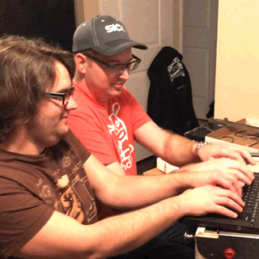

This week’s pinball work session was highly distracted, thanks to Randy [bringing along his new binary game project](https://github.com/SurrealityLabs/binarygame/).

Here’s a rundown of the progress that was made:

* Danny and Randy worked on updating this website
* Mike and Alex continued work on getting MPF 0.5 to work with our config, and our hardware drivers. We’ve restored the ability to control normal lamps, as well as RGB LEDs. Shot groups are back
* The new MPF debug interface is VERY MUCH APPRECIATED
* Alex started working on a MPF driver to interface with our score display boards
* Randy finished off the latest revision of the Raspberry Pi CAN HAT, so that’s ready to be sent off for manufacture

Some action items were set:

* Randy will continue work on new firmware, as soon as the USB to CAN adapter boards arrive from OSHPark
* Alex and Mike will continue work on the MPF 0.5 upgrade
* Mike will select an new connector for switch inputs, to be used as part of Base Board Version 3.0
* Everyone will continue to work on the website