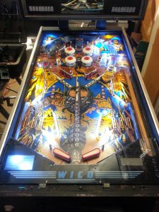

AF-TOR is a machine released in 1984 by Wico. Mike picked up this one from Kijiji in 2012, listed as “somewhat working”. This is code for “broken”. This is the machine that started us on this merry adventure.

# External Links
* [AF-TOR at the Internet Pinball Database](http://www.ipdb.org/machine.cgi?gid=25)
* [Understanding Pinball – Wico’s AFTOR – Part One – Learn How It Plays! – TNT Amusements on YouTube](http://www.youtube.com/watch?v=rwkggZ02r4E)
* [Understanding Pinball – Wico’s AFTOR – Part Two – Learn How It Plays! – TNT Amusements on YouTube](http://www.youtube.com/watch?v=6ENvjETb4TY)