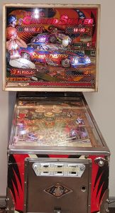

Nitro Ground Shaker was introduced by Bally in early 1980. It came to us without any electronics which saved us the trouble of tearing everything out. Its mainly wood body also makes it much lighter and more maneuverable than AF-TOR.

# External Links
* [Nitro Ground Shaker at the Internet Pinball Database](http://www.ipdb.org/machine.cgi?id=1682)
* [Nitro Ground Shaker Details on YouTube](https://www.youtube.com/watch?v=fD7Jcgnn8hI)