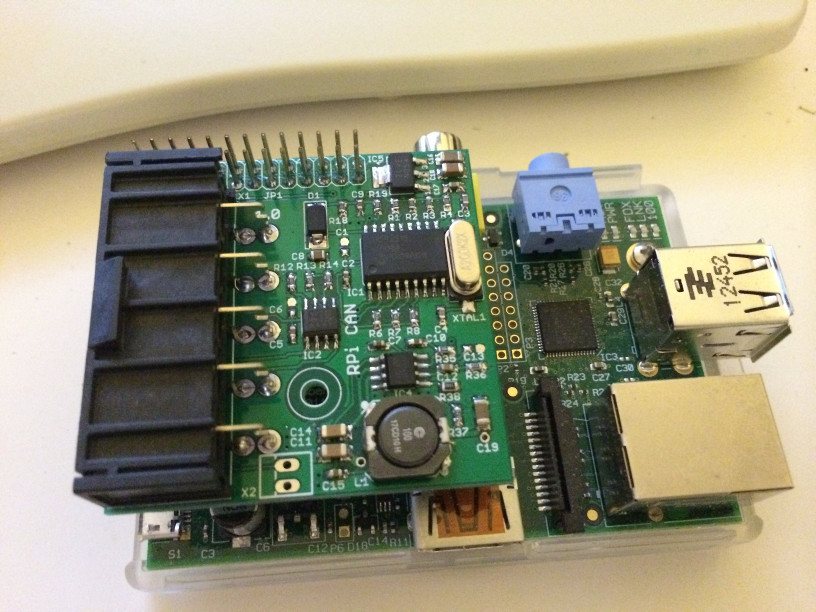

The Raspberry Pi CAN Interface Board, Version 1.0 is based on the MCP2515 SPI to CAN integrated circuit. It also has a 12V to 5V switching voltage regulator, to provide the Raspberry Pi with power from the machine’s 12V power supply. This version of the board is targeted at earlier Raspberry Pi models, such as the original Raspberry Pi Model B. It uses our original, very expensive connector for wiring.

More information on this board can be found [on our Github](https://github.com/diypinball/pi-can-1).